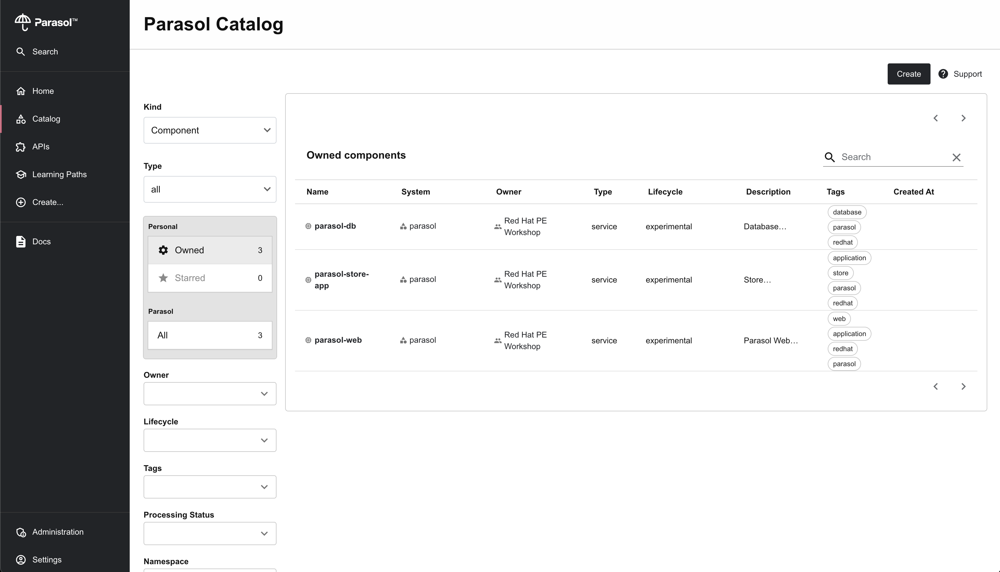

# Red Hat Developer Hub Demo Environment

_Note that this environment is currently designed for use with the [Red Hat Developer Hub Demo](https://github.com/rhdh-demo-gh/) organisation on GitHub. This could be parameterised in the future._

The environment features:

* Red Hat Developer Hub instance managed using OpenShift GitOps ([Helm Chart](https://docs.redhat.com/en/documentation/red_hat_developer_hub/1.2/html/installing_red_hat_developer_hub_on_openshift_container_platform/assembly-install-rhdh-ocp#assembly-install-rhdh-ocp-helm))
* A [Custom Theme](https://docs.redhat.com/en/documentation/red_hat_developer_hub/1.2/html/getting_started_with_red_hat_developer_hub/assembly-customize-rhdh-theme)
* OIDC Authentication using [Red Hat build of Keycloak](https://access.redhat.com/products/red-hat-build-of-keycloak)
* Catalog Entites loaded from a GitHub Organisation (`catalog-info.yaml` from repositories)
* TechDocs hosted in AWS S3
* Plugins ([using the Dynamic Plugins feature](https://docs.redhat.com/en/documentation/red_hat_developer_hub/1.1/html/administration_guide_for_red_hat_developer_hub/rhdh-installing-dynamic-plugins)):
    * [Argo CD](https://docs.redhat.com/en/documentation/red_hat_developer_hub/1.2/html/configuring_plugins_in_red_hat_developer_hub/rhdh-installing-dynamic-plugins#rhdh-argocd)
    * [TechDocs](https://docs.redhat.com/en/documentation/red_hat_developer_hub/1.2/html/administration_guide_for_red_hat_developer_hub/assembly-techdocs-plugin_assembly-admin-templates)
    * [GitHub Discovery](https://backstage.io/docs/integrations/github/discovery/)


<div align="center">
    <br>
	
</div>

## Setup

## Prerequisites

<details>

<summary>OpenShift Cluster</summary>

Requires an OpenShift 4.16 cluster. It's possible to use a 
[Single Node OpenShift on AWS](https://developers.redhat.com/articles/2024/04/29/how-install-single-node-openshift-aws#installing_the_ocp_client_and_getting_the_installation_program)
with SSL certificates [configured using Certbot](https://gist.github.com/evanshortiss/c60e0cb394ffa8610ee76bd64e1c3d52).

</details>

<details>

<summary>Ansible</summary>

This repository has been tested with Ansible 2.17.4 on macOS, using
[`pipx`](https://github.com/pypa/pipx) to manage the Python environment for
Ansible and dependecnies.

```bash
brew install pipx
pipx ensurepath

# Install Ansible
pipx install --include-deps ansible

# Install dependencies required by the playbooks
pipx inject ansible kubernetes jmespath
```
</details>

<details>

<summary>GitHub Organisation & Personal Access Token (PAT)</summary>

A [GitHub Personal Access Token](https://docs.github.com/en/authentication/keeping-your-account-and-data-secure/managing-your-personal-access-tokens#about-personal-access-tokens)
is required to provide Red Hat Developer Hub (Backstage) plugins with
authenticated access to the GitHub API.

1. Create a [new GitHub Organisation](https://github.com/organizations/new) with repositories similar to the [Red Hat Developer Hub Demo Organisation](https://github.com/rhdh-demo-gh/). 
1. Allow access using fine-grained personal access in the organisation's settings.
1. [Create a fine-graind personal access token](https://github.com/settings/personal-access-tokens/new) from your account with the following configuration:
    * Repository access: All respositories
    * Permissions: (Read) Contents, (Read) Commit Statuses

Depending on your choices in step 2 above, an organisation administrator might
need to approve the token before it can be used.

</details>

<details>
<summary>AWS S3 Bucket and Credentials</summary>

TODO: Steps to create a R/W IAM Role to publish TechDocs and 

</details>

## Setup & Usage

Login to your OpenShift instance using the `oc` CLI, prepare environment
variables, and run the installation playbook.

```bash
oc login --token $TOKEN --server=-server=https://api.yourcluster.com:6443

# Create a .env, edit with required values, and load those into the terminal
# session. These values are the AWS S3 bucket name, region, and IAM credentials
# to access the TechDocs stored in the bucket. Also, the GitHub PAT to load
# catalog entities from catalog-info.yaml files in the organisation's repos
cp .env.example .env
source .env

ansible-playbook playbooks/ocp4_workload_platform_engineering_workshop.yml \
-e rhdh_gh_pat=$GITHUB_TOKEN \
-e rhdh_gh_client_id=$AUTH_GITHUB_CLIENT_ID \
-e rhdh_gh_client_secret=$AUTH_GITHUB_CLIENT_SECRET \
-e quay_token=$QUAY_TOKEN \
-e techdocs_bucketname=$TECHDOCS_BUCKETNAME \
-e techdocs_accesskeyid=$TECHDOCS_ACCESSKEYID \
-e techdocs_secretaccesskey=$TECHDOCS_SECRETACCESSKEY \
-e techdocs_region=$TECHDOCS_REGION
```

After the playbook has run, you can login to Red Hat Developer Hub as `johndoe`
using the password `password`.